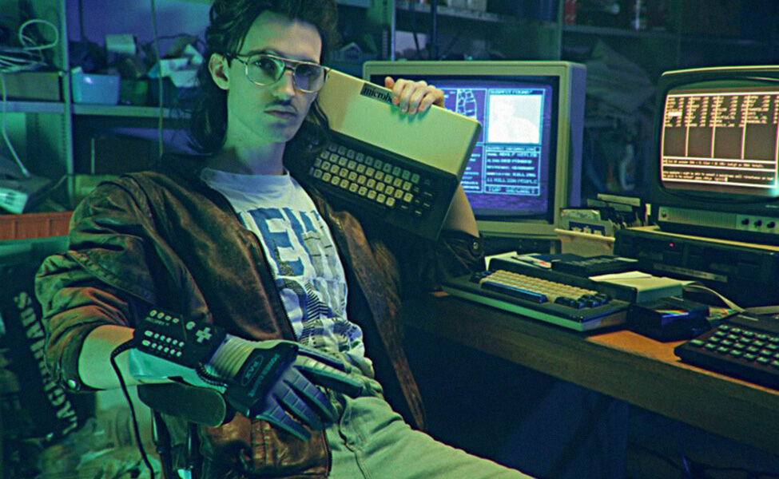

## Hackerman- Unironically
In high school we were allowed school laptops, which were Macbooks and in later years Macbook Airs, with certain permissions and allowances. Little did I know that these rules and regulations would shape my personal interest and drive my passion for reverse engineering, internet privacy and network security. In our sophomore year, although against school code, we tried our best to get rid of as many walls that our computers allowed us to. Within limitations we would download and run games and programs that we normally couldn't and create website proxies to allow us to access unreachable websites on school WiFi. One achievement that led to our downfall was creating admin accounts. Mac root commands used to allow sudo commands to create new users on the laptop with admin permissions. Giving full access to base user, it fully unlocked the laptop to do anything you please. When creating these new users though, it changed the laptop IP which was traced by the school and our little group got in trouble.

For a semester, we were on computer suspension which means instead of being able to take our computer home to get work done, we would have to turn it in every afternoon before we left campus. Our group then started to tinker with mobile programs such as SMS bombers which would spam text messages until it overwhelmed a device and also a WiFi spoofer and sniffer which showed everyone's IP that was connected to the campus wide network and could temporarily disconnect specific users or the whole network. Although this was all fun and games, these are the things that people get in a lot of trouble for so we stopped our antics. I learned more about ethical hacking and have an extreme interest in attending Defcon which is a convention based around all types of hacking.

Of course these types of holes that we exposed can cause people with malicious intentions to take advantage of certain businesses and companies, but these projects developed into an interest in reverse engineering and network security. If certain businesses have vulnerabilities, it is important for them to know before any real trouble occurs. Internet privacy and security is important because you never know where you may leave your digital footprint. I hope to learn more and grow these skill sets that shape my future in software developemnt.

  

