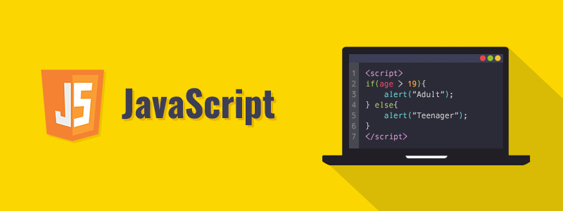

  

## All coding languages have their uses
Coming from an engineering and hardware design background where everything is compiled into assembly code then translated into machine language, Javascript is personally a godsend because it's easy to pick up. Having background in C, C++, Python, various assembly code, etc., having a runtime compiler in Javascript and not having to write into main is a huge convenience. Certain variables aren't strictly defined either?! Learning Javascript was a fun experience and I see why it's useful for web development where you don't need a specific compiler for different workspace environments. I didn't exactly know what to expect at the start.

## Sprinting your laps
The athletic software engineering mindset is to run the race instead of pacing slowly through it. One may think that this causes sloppy code, but I personally think highly of those who are able to sprint. Practicing quick thinking and clean coding allows one to become proficient and efficient in their field. With this in mind, practices such as Workouts of the Day are a fantastic way to get into the sprinters mindset. Having a certain amount of time to solve daily problems allows people to practice often and practice with purpose. Having a time constraint forces one into a stressful situation. Releasing cortisol into your system will cause anxiety and stress, but your body will become use to it in time. With enough training I believe that anyone can become the athletic software engineer they strive to be and run that sprint in record time.

I like the idea of working out instead of studying theory. In practice you are able to develop standards that you can improve and actually implement in daily coding. Being a computer engineering student, a large majority of my hardware side curriculum circulates around theory and proofs of algorithms, quantum mechanics of physics involving electromagnetic semiconductors and signal processing. Of course homework and practice problems 'workout' these theories, but practicing while you're learning or working out problem solving on the fly is a different way of thinking and is increasingly more engaging.
