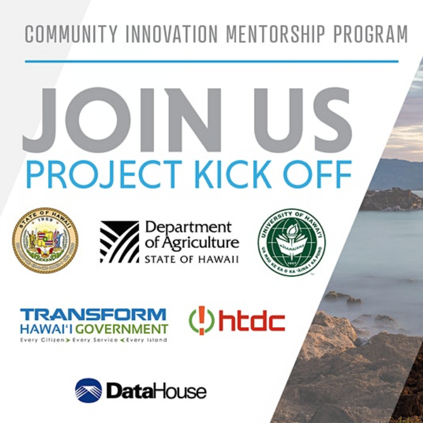

  

As a 396 project, we are pairing with Datahouse and other development/IT teams to deliver a solution to the Hawaii Department of Agriculture's problem with animal quarantine. Being the only rabies free state, Hawaii deals with many problems with reuniting pets with their families. In digitalizing paperwork (databasing), creating a smart queuing strategy (kiosks), and teaching the Department of Agriculture how to manage and implement our systems, our hope is to give something back to the community that will hopefully get our wonderful furry friends connected back to the families that they love and adore in little to no time.
